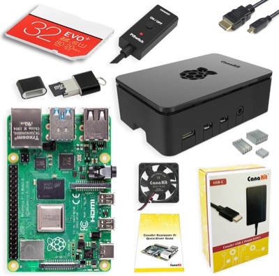

# pidog-groove

**PiDog écoute la musique autour de lui et bouge la tête et la queue en rythme.**

Pas de fichier à jouer, pas de partition : il utilise **son propre micro**,
détecte le tempo de ce qu'il entend, et tombe sur les temps. Dites-lui
« PiDog, écoute la musique » et il se met à hocher la tête sur ce qui passe.

Quatrième projet de la famille, après [pidog-voice](https://github.com/koua29/pidog-voice),
[pidog-energy](https://github.com/koua29/pidog-energy) et
[pidog-patrol](https://github.com/koua29/pidog-patrol).

---

## Le vrai problème : le chien s'entend lui-même

Détecter un tempo est un exercice classique. Ce qui rend ce projet difficile
est propre au robot, et c'est **mesuré, pas supposé** : les servos en mouvement
portent le bruit à **1513 RMS contre 35 au silence** — 42 fois plus fort que la
musique captée. Un chien qui bouge la tête pour écouter s'entend donc surtout
lui-même, et un détecteur naïf verrouille sur le rythme de ses propres servos
(~85 BPM) au lieu de celui du morceau.

La parade tient à une chose qu'on connaît exactement : **l'instant où l'on
commande chaque geste**. On masque donc ces fenêtres-là du micro. Le robot
n'analyse que ce qu'il entend *entre* ses mouvements.

```
   ┌─ écoute immobile 8 s ──┐
   │  estime tempo + phase  │   confiance suffisante ?
   └────────────┬───────────┘
                │ oui
                ▼
   ┌─ prédit les temps suivants ─┐   ← plus besoin d'entendre CHAQUE temps
   │  bouge dessus (tête, queue) │
   │  masque le micro pendant    │   ← c'est ce qui rend le bruit supportable
   │  ré-estime dans les creux   │
   └─────────────────────────────┘
```

Une fois le tempo accroché, il est **prédit** entre deux ré-estimations : le
robot n'a plus besoin d'entendre chaque temps, seulement de recaler de temps en
temps. C'est ce qui rend le bruit des servos supportable.

## Ce qu'il fait, ce qu'il ne fait pas

- **Tête et queue seulement.** Pas les pattes : rien à faire tomber, peu de
  courant tiré.
- **Aucun son émis.** Il écoute, il ne joue rien. Le haut-parleur reste libre
  pour la musique que vous mettez.
- **N'importe quelle source.** Une enceinte, la télé, vous qui chantez — tant
  que ça a une pulsation nette.

## La détection de tempo, vérifiée

Tout tient sur le Pi, **sans librosa** : une enveloppe d'attaque par flux
spectral (une FFT de 1024 points coûte 86 µs sur ce Pi 4) et une
autocorrélation. Deux corrections, chacune tirée d'un échec mesuré :

- **Somme des harmoniques.** Sur un enregistrement réel à 120 BPM, le pic brut
  le plus haut tombait à 60 — le demi-tempo, piège classique de
  l'autocorrélation. Une vraie période se distingue parce que ses multiples
  corrèlent aussi ; une subdivision, non.
- **Périodes fractionnaires.** À 160 BPM la période vaut 37,5 trames de 10 ms :
  en entiers, l'erreur d'arrondi s'accumule sur les harmoniques et le score
  s'effondre. On évalue donc des périodes flottantes.

La méthode est calibrée contre une **vérité terrain** : la musique enregistrée
au micro du robot, analysée par librosa sur une machine séparée. Résultat sur
six fenêtres glissantes d'un morceau à 120,0 BPM :

| fenêtre | tempo trouvé | confiance |
|---|---|---|
| 0–8 s | 120,6 | 1,51 |
| 4–12 s | 121,2 | 1,17 |
| 8–16 s | 121,8 | 1,16 |
| 12–20 s | 121,2 | 1,00 |
| 16–24 s | 120,0 | 0,93 |
| 20–28 s | 120,3 | 1,15 |

Pour référence, du bruit blanc donne une confiance de 0,13, de la parole 0,09 :
le seuil de déclenchement est à 0,45, loin des deux.

## Installation

Sur le Pi :

```bash
rsync -az --exclude __pycache__ ./ pidog:~/script/pidog-groove/
ssh pidog 'python3 ~/script/pidog-groove/outils/verifier.py'
```

`verifier.py` contrôle la configuration et capte 2 s de micro sans toucher aux
servos.

## Utilisation

```bash
python3 ecoute.py                 # jusqu'à duree_max_s, Ctrl-C pour sortir
python3 ecoute.py --duree 60
python3 ecoute.py --sans-robot    # écoute et affiche le tempo, sans bouger
python3 tests/test_rythme.py      # 11 tests, aucun matériel requis
```

À la voix, après `install/integrer_pidog_voice.sh` : **« PiDog, écoute la
musique. »** L'écoute vocale se suspend pendant ce temps — il partagerait sinon
le micro et le GPIO — et repart toute seule à la fin.

## Régler le rendu

Tout est dans `config.json`, sans toucher au code.

**Le vocabulaire de gestes** est une liste de figures tirées au sort, pondérées.
Chaque `tete` est `[lacet, roulis, tangage]` en fractions des amplitudes. Deux
garde-fous : jamais deux fois la même figure de suite, et jamais deux positions
voisines (sinon le tirage produit un geste imperceptible qui se lit comme un
raté).

**`temps_par_geste`** — un geste toutes les N noires. À 2 il danse plus, à 3 il
entend mieux : plus il bouge, plus il se couvre. C'est le premier réglage à
monter s'il perd le rythme.

**`fraction_attaque`** ne décide pas que de l'allure, mais de ce qu'il *entend* :
c'est la part du temps consacrée au mouvement, le reste étant tenu immobile —
donc disponible pour écouter.

## Pièges éventés

Chacun a coûté une séance.

**Le PATH sans `/usr/sbin`.** `robot_hat` appelle `i2cdetect` pour scanner le
bus I2C. Lancé depuis un SSH ordinaire, ce chemin manque, la commande est
introuvable, le scan renvoie une liste **vide**, et la bibliothèque écrit
ensuite dans le vide **sans lever la moindre erreur** — fils d'exécution
vivants, compteurs de gestes parfaits, aucun servo qui bouge. Le programme
corrige donc son propre PATH au démarrage.

**`Pidog()` peut démarrer sans ses fils d'exécution.** Il rend la main avec un
seul thread et zéro moteur pilotable, sans erreur. Le programme **vérifie que
`head_thread` et `tail_thread` tournent** avant de commander quoi que ce soit,
et refuse de continuer sinon.

**Ne jamais `kill -9` le robot.** Un arrêt forcé laisse des lignes GPIO
ouvertes → `GPIO busy` au lancement suivant et initialisation instable. On
arrête par SIGTERM puis SIGINT.

**Il perdait le rythme en pleine musique.** Immobile il mesurait une confiance
de 1,45 ; en dansant, 0,65. Une mesure ratée pendant qu'il bouge ne veut pas
dire que la musique s'est arrêtée : le tempo d'un morceau ne change pas, donc la
patience avant abandon est **généreuse à dessein** (40 s), et le tempo est
prédit entre deux recalages.

## 🤝 Le matériel du projet

*Liens partenaires Amazon : si vous achetez via ces liens, le projet touche une petite
commission, sans surcoût pour vous. Ce sont le matériel
du projet : la carte qui tourne dans le chien, sa carte mémoire et le Mac qui fait tourner l'IA.*

<table>
<tr>
<td align="center" width="33%">
  <a href="https://www.amazon.com/dp/B07V5JTMV9?linkCode=ll2&amp;tag=koua29-20&amp;ref_=as_li_ss_tl"></a><br>
  <b><a href="https://www.amazon.com/dp/B07V5JTMV9?linkCode=ll2&amp;tag=koua29-20&amp;ref_=as_li_ss_tl">CanaKit Raspberry Pi 4 (4 GB)</a></b><br><sub>Kit avec la carte qui tourne dans le chien</sub>
</td>
<td align="center" width="33%">
  <a href="https://www.amazon.com/dp/B0B7NVMBPL?linkCode=ll2&amp;tag=koua29-20&amp;ref_=as_li_ss_tl"></a><br>
  <b><a href="https://www.amazon.com/dp/B0B7NVMBPL?linkCode=ll2&amp;tag=koua29-20&amp;ref_=as_li_ss_tl">SanDisk 64 GB microSD (2-pack)</a></b><br><sub>Raspberry Pi OS et les fichiers du projet</sub>
</td>
<td align="center" width="33%">
  <a href="https://www.amazon.com/dp/B0DM71CDHV?linkCode=ll2&amp;tag=koua29-20&amp;ref_=as_li_ss_tl"></a><br>
  <b><a href="https://www.amazon.com/dp/B0DM71CDHV?linkCode=ll2&amp;tag=koua29-20&amp;ref_=as_li_ss_tl">Apple Mac mini (M4)</a></b><br><sub>Le cerveau — Whisper + Ollama</sub>
</td>
</tr>
</table>

## ☕ Offrez-moi un café

Ce projet est gratuit et open source. S'il vous est utile, vous pouvez me remercier
en m'offrant un café — il suffit de scanner ce QR code PayPal. Merci beaucoup ! 🙏

<p align="center">
  
</p>

## La famille PiDog

- **[pidog-voice](https://github.com/koua29/pidog-voice)** — commande vocale française
- **[pidog-energy](https://github.com/koua29/pidog-energy)** — surveillance de batterie
- **[pidog-patrol](https://github.com/koua29/pidog-patrol)** — patrouille autonome
- **pidog-groove** — vous êtes ici

## Licence

[MIT](LICENSE) © 2026 koua29
